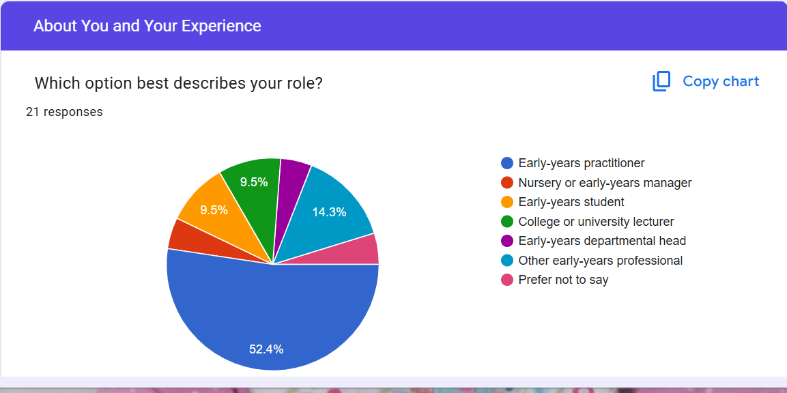
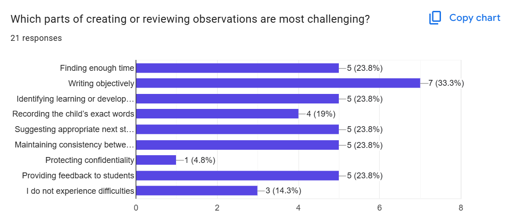
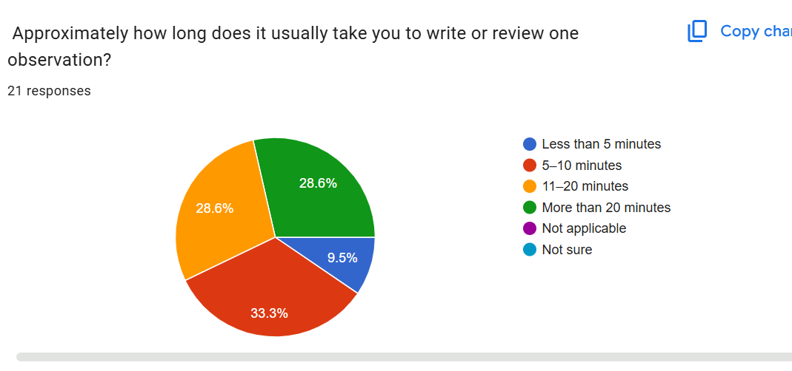
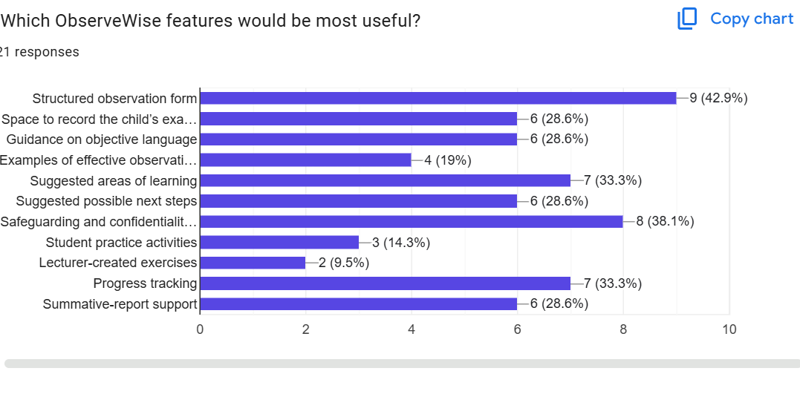
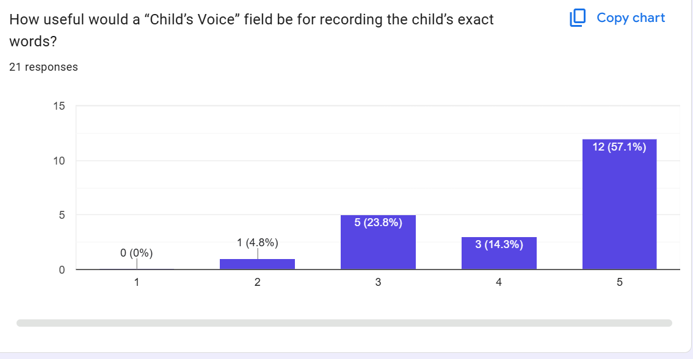
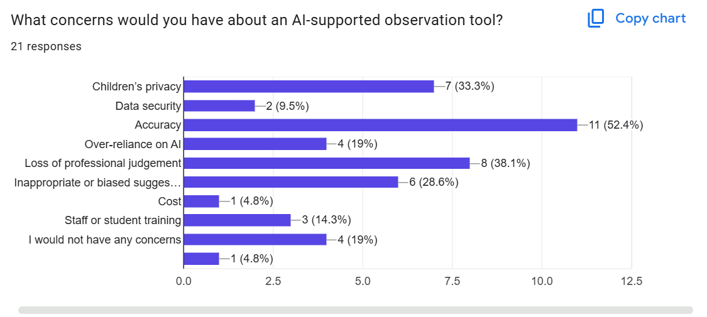
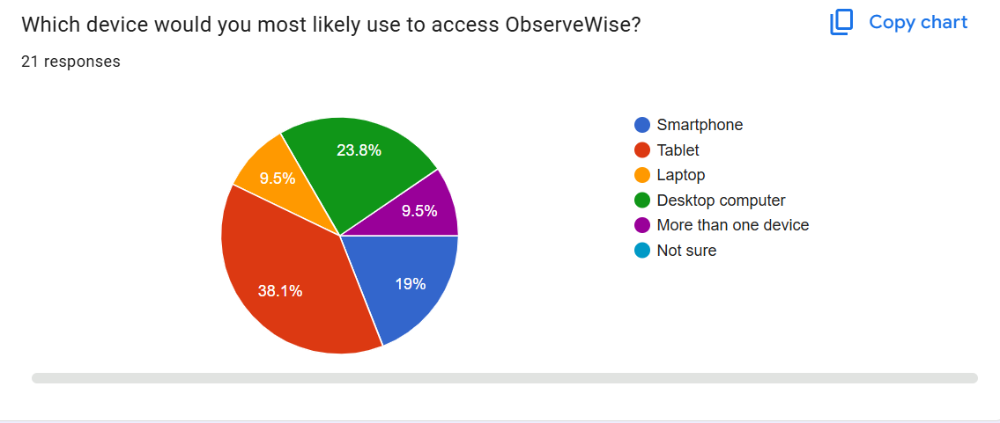
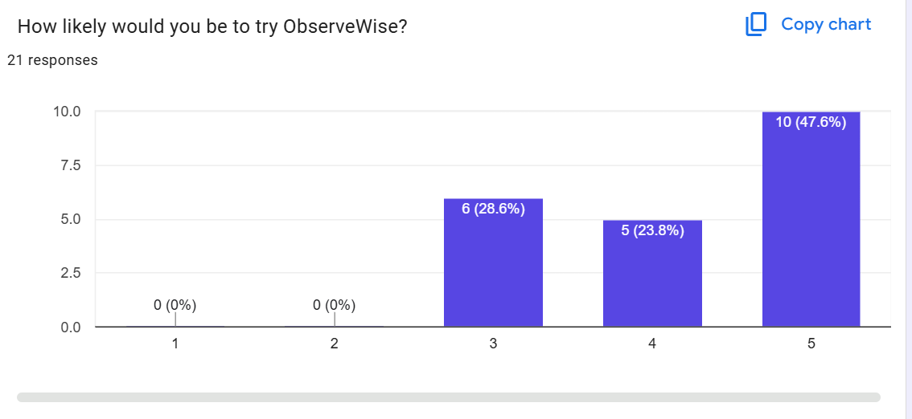

# ObserveWise
A responsive website and early-years observation prototype for practitioners and students.

## Project Overview

ObserveWise is a responsive informational website and static observation prototype created for early-years practitioners, students and education professionals.

The project explores how a structured digital tool could support clear, objective and efficient early-years observations. It also provides students with guidance to help them develop professional observation-writing skills.

This first version is a front-end prototype. It does not use artificial intelligence, store information or create genuine child records. Users must not enter real children's personal information into the prototype.

## Project Purpose and Goals

Early-years practitioners need to record meaningful observations while spending as much time as possible supporting children. Students also need opportunities to practise writing observations using clear, objective and professional language.

ObserveWise aims to:

- Demonstrate a clear and structured observation process.
- Help practitioners record observations more efficiently.
- Provide a dedicated space for recording the child's exact words.
- Help students develop professional observation-writing skills.
- Promote objective language and reflective practice.
- Keep safeguarding, confidentiality and professional judgement central to the concept.
- Provide an accessible and responsive experience across mobile, tablet and desktop devices.

- ## Research

Research was completed to understand the professional requirements of early-years observations and the needs and concerns of potential ObserveWise users.

### Secondary Research

Secondary research will examine official government guidance, the Early Years Foundation Stage statutory framework and relevant academic literature. The findings will be used to ensure that ObserveWise reflects professional expectations surrounding observation, safeguarding, confidentiality and children's learning and development.
#### Early Years Foundation Stage Statutory Framework

The [Early Years Foundation Stage statutory framework](https://www.gov.uk/government/publications/early-years-foundation-stage-framework--2) sets the mandatory standards that early-years providers in England must follow. These standards are intended to support children's learning and development, protect their health and safety, and prepare them for school.

This influenced the decision to make safeguarding, confidentiality and children's learning and development central to ObserveWise. It also demonstrated that the prototype should support practitioners rather than attempt to replace their professional responsibilities or judgement.

#### Development Matters

[Development Matters](https://www.gov.uk/government/publications/development-matters--2) is non-statutory curriculum guidance for early-years practitioners. It explains that assessment involves noticing what children know and can do and should not become an exercise in collecting large quantities of data and evidence.

This supported the decision to create a concise, structured observation form. ObserveWise is intended to help practitioners organise meaningful information without encouraging excessive recording or taking practitioners away from their interactions with children.

#### Education Endowment Foundation

The [Education Endowment Foundation Early Years Evidence Store](https://educationendowmentfoundation.org.uk/early-years/evidence-store) encourages educators to combine research evidence with their professional expertise when developing high-quality practice.

This influenced the decision to present ObserveWise as a support tool rather than an authority that makes decisions for practitioners. Suggestions produced by a future version of the service would need to be reviewed by a qualified professional before use.

#### Academic Journal Research

Cowan and Flewitt's peer-reviewed article, [Moving from paper-based to digital documentation in Early Childhood Education: democratic potentials and challenges](https://doi.org/10.1080/09669760.2021.2013171), examines the move from paper-based observations to digital documentation. The research suggests that digital documentation can support inclusive and participatory assessment by helping practitioners notice different forms of learning, including children's gestures, movements and other non-verbal expressions.

This influenced the decision to include separate structured fields rather than relying on one general text box. A future version of ObserveWise could support different forms of evidence, but practitioners would remain responsible for interpreting children's learning within its full context. As this was a small-scale study, its findings should not be treated as universally applicable.

Berson, Berson and Luo's peer-reviewed scoping review, [Innovating responsibly: ethical considerations for AI in early childhood education](https://doi.org/10.1007/s44436-025-00003-5), examined 42 studies. It identified important concerns involving children's data privacy, child development, algorithmic bias and regulation.

This research reinforced several ObserveWise decisions:

- The Project 1 prototype must not collect or store real children's information.
- Users should use a pseudonym or identifier rather than a child's full name.
- Any future AI suggestions must be reviewed by a practitioner.
- AI must not replace professional judgement.
- A future working service would require transparent data controls, strong security and further legal and ethical research.

### Primary User Research

Primary research was conducted using a Google Forms questionnaire. The questionnaire received 21 responses from people connected with early-years practice and education.

The questionnaire explored:

- Respondents' roles and experience.
- Confidence in writing or reviewing observations.
- Difficulties experienced during the observation process.
- The time needed to write or review an observation.
- Features respondents would find useful.
- The usefulness of a dedicated Child's Voice field.
- Concerns about an AI-supported observation tool.
- Preferred devices for accessing ObserveWise.
- Respondents' likelihood of trying the proposed service.

 #### Key Survey Findings

The survey findings helped determine which problems and features should receive the greatest attention in ObserveWise.

| Finding | Survey result | Influence on ObserveWise |
|---|---:|---|
| Early-years practitioners were the largest respondent group | 52.4% | Practitioners became the primary target audience |
| Writing objectively was the most selected challenge | 33.3% | Objective-language guidance became a planned feature |
| Respondents taking more than 10 minutes to write or review an observation | 57.2% | The prototype uses a concise, structured form |
| A structured observation form was the most requested feature | 42.9% | The structured form became the prototype's central feature |
| Safeguarding and confidentiality were selected as useful features | 38.1% | Safety guidance and a no-real-data warning were prioritised |
| Accuracy was the most selected concern about AI | 52.4% | Future AI output must be checked by a practitioner |
| Loss of professional judgement was an AI concern | 38.1% | ObserveWise is presented as support rather than a replacement for practitioners |
| Respondents rating the Child's Voice field as 4 or 5 | 71.4% | A dedicated Child's Voice field was included |
| Tablet was the most selected device | 38.1% | Tablet-responsive design became an important requirement |
| Respondents rating their likelihood of trying ObserveWise as 4 or 5 | 71.4% | The result supported continuing with the prototype |

#### Research Limitations

The questionnaire was exploratory and received 21 responses. This was a useful starting point, but the sample was relatively small and cannot represent the entire early-years sector.

Early-years practitioners made up 52.4% of respondents, meaning that practitioners were represented more strongly than students, lecturers, managers and departmental heads. The findings may therefore reflect practitioner needs more strongly than the needs of every intended user group.

Some open-text responses were brief or did not provide enough detail to influence a design decision. Further research should involve a larger and more balanced group of participants, followed by usability testing with practitioners, students and education professionals.

A question about payment was deliberately excluded because ObserveWise is still at the problem-validation and prototype stage. Understanding users' needs, concerns and willingness to try the concept was considered more appropriate than asking respondents to evaluate pricing before a working service exists.

#### Survey Evidence

The following anonymised charts provide supporting evidence for the survey findings and resulting design decisions.

## Target Audience

### Primary Audience

ObserveWise is primarily designed for early-years practitioners. Practitioners were the largest group in the user survey, representing 52.4% of the 21 respondents. They need an efficient and structured way to record clear, objective observations while keeping professional judgement, safeguarding and confidentiality central to their practice.

### Secondary Audiences

ObserveWise also supports:

- Early-years students who are developing their observation-writing skills.
- Nursery and early-years managers who may support consistency and review practice.
- College and university lecturers who teach and assess early-years students.
- Early-years departmental heads who may oversee teaching, training and quality.
- Other professionals connected with early-years practice and education.

Although these groups have different responsibilities, they share a need for clear observation structures, objective language and appropriate safeguarding guidance.

## User Stories

The user stories were developed from the primary and secondary research. They describe what each audience needs from ObserveWise and provide a basis for deciding which features to include in the first version.

### Early-years Practitioners

- As an early-years practitioner, I want to complete an observation using a clear and structured form, so that I can record meaningful information efficiently and spend more time supporting children.
- As an early-years practitioner, I want guidance on using objective language, so that my observations remain factual and professional.
- As an early-years practitioner, I want a dedicated Child's Voice field, so that I can record the child's exact words separately from my interpretation.
- As an early-years practitioner, I want prompts for possible areas of learning and next steps, so that I can reflect on how to support the child's development.
- As an early-years practitioner, I want clear confidentiality guidance, so that I understand how to use the prototype safely and avoid entering real children's personal information.
- As an early-years practitioner, I want the website to work on tablets, smartphones and computers, so that I can use it on the device available to me.

### Early-years Students

- As an early-years student, I want examples of effective observations, so that I can understand the difference between objective description and personal interpretation.
- As an early-years student, I want a structured practice form, so that I can develop my observation-writing skills.
- As an early-years student, I want guidance explaining each part of an observation, so that I can understand what information to include.
- As an early-years student, I want safeguarding reminders, so that I can practise handling children's information responsibly.

### Managers and Education Professionals

- As an early-years manager, I want a consistent observation structure, so that I can support clear practice across my setting.
- As a lecturer, I want ObserveWise to provide observation-writing examples and practice activities, so that I can use it to support early-years students.
- As a lecturer, I want students to understand objective language and professional judgement, so that they can develop responsible observation skills.
- As an early-years departmental head, I want the resource to reflect safeguarding and professional expectations, so that it is appropriate for education and training.

- ## Feature Prioritisation

The MoSCoW method was used to prioritise features. This keeps the first version achievable while ensuring that the most important needs identified through research are addressed.

### Must Have

- Clear information explaining ObserveWise and its purpose.
- A responsive layout that works on mobile, tablet and desktop devices.
- Simple and consistent navigation.
- A structured early-years observation form.
- A field for a child pseudonym or identifier instead of a real name.
- A dedicated Child's Voice field for recording the child's exact words.
- Fields for observations, learning and possible next steps.
- Guidance encouraging clear and objective language.
- Safeguarding and confidentiality warnings.
- A warning that users must not enter real children's personal information.
- Accessible form labels, headings, colour contrast and keyboard navigation.
-  A custom 404 page that helps users return to the website.

- ### Should Have

- Examples showing the difference between objective and subjective language.
- Guidance explaining each section of the observation form.
- Suggested areas of learning for users to consider.
- Information for students developing observation-writing skills.
- Information for managers, lecturers and departmental heads.
- Clear confirmation after the prototype form is completed.

### Could Have

- Additional observation-writing practice activities.
- A downloadable blank observation template.
- More examples covering different early-years situations.
- A frequently asked questions section.
- An optional form for users to provide feedback about the prototype.

### Won't Have in This Version

- Artificial-intelligence-generated observations or recommendations.
- User accounts or login functionality.
- Storage of observations or children's information.
- Creation of genuine child records.
- Automatic progress tracking or summative reports.
- Payment or subscription functionality.
- Communication between settings, practitioners, students or families.

These features are outside the scope of Project 1 because ObserveWise is currently a front-end prototype. They may be considered for a future version following further research, technical development and legal, ethical and safeguarding review.

## Website Structure

ObserveWise will use a clear multi-page structure so that each audience can find relevant information easily.

### Planned Pages

- **Home (`index.html`)** — introduces ObserveWise, explains its purpose and directs users to the main areas of the website.
- **Observation Guide (`guide.html`)** — provides guidance on objective language, Child's Voice, safeguarding and effective observation writing.
- **Student Learning Hub (`students.html`)** — provides examples, explanations and practice support for early-years students.
- **Try the Prototype (`prototype.html`)** — contains the structured early-years observation form.
- **Custom 404 Page (`404.html`)** — explains that a requested page could not be found and provides a link back to the homepage.

The four main pages will appear in the navigation menu. The 404 page will not appear in the navigation because it is only shown when a user attempts to visit a page that does not exist.
